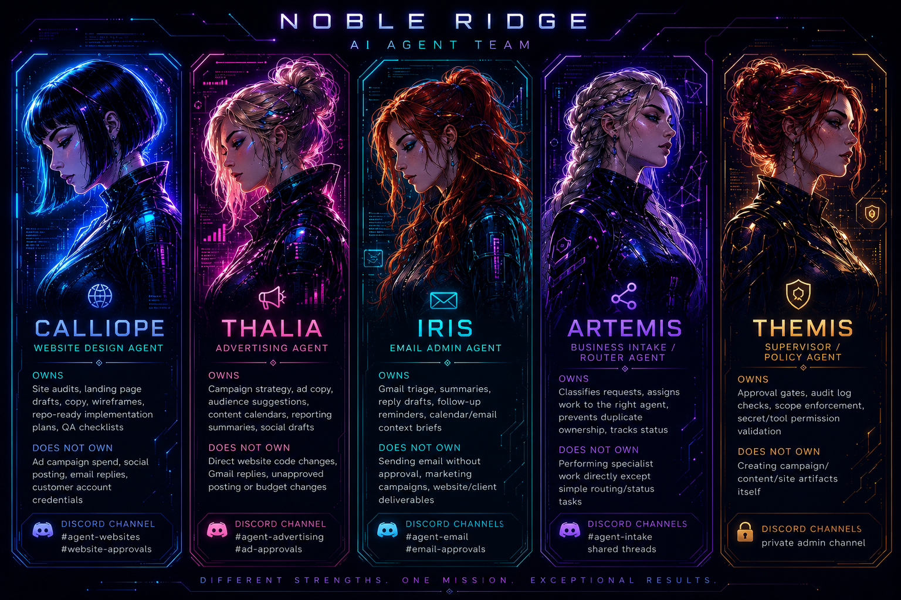

# Noble Ridge AI Agent Platform



## Purpose

This repository is the home for the Noble Ridge Technologies agent platform. The platform will run the Noble Ridge AI Agent Team: a set of bounded, role-specific agents that support website design, advertising operations, email administration, business intake, and policy enforcement.

The first build target is Iris, the Email Admin Agent, because it gives useful business value while keeping v1 low risk: read Gmail, summarize, extract action items, and draft replies for approval without sending email automatically.

## Platform Direction

- **Host:** Ubuntu 3 and the local AI inference homelab.
- **Initial orchestrator:** Hermes, if it fits the implementation cleanly.
- **Interface:** Discord business server channels for requests, approvals, status, and team interaction.
- **First proof point:** Iris email administration.
- **Default safety posture:** internal-first, human-approved, audit-logged.
- **Design principle:** agents own distinct swimlanes and do not overlap responsibilities.

## Agent Team

| Agent | Role | Owns | Does Not Own |
| --- | --- | --- | --- |
| Calliope | Website Design Agent | Site audits, landing page drafts, copy, wireframes, repo-ready implementation plans, QA checklists | Ad spend, social posting, email replies, customer credentials |
| Thalia | Advertising Agent | Campaign strategy, ad copy, audience suggestions, content calendars, reporting summaries, social drafts | Website code changes, Gmail replies, unapproved posting, budget changes |
| Iris | Email Admin Agent | Gmail triage, summaries, reply drafts, follow-up reminders, calendar/email context briefs | Sending email without approval, marketing campaigns, website/client deliverables |
| Artemis | Business Intake / Router Agent | Request classification, agent assignment, duplicate prevention, status tracking | Specialist execution except simple routing/status work |
| Themis | Supervisor / Policy Agent | Approval gates, audit checks, scope enforcement, secret/tool permission validation | Creating campaign, content, or website artifacts |

## Discord Channel Model

| Channel | Purpose |
| --- | --- |
| `#agent-intake` | General business requests and Artemis routing |
| `#agent-email` | Iris email summaries, searches, and draft work |
| `#email-approvals` | Human approval flow for Iris-generated drafts |
| `#agent-websites` | Calliope website design and audit work |
| `#website-approvals` | Human approval for website artifacts or repo changes |
| `#agent-advertising` | Thalia campaign and social drafting work |
| `#ad-approvals` | Human approval for campaign changes, social posts, and ad activity |
| Private admin channel | Themis policy alerts, permission issues, and audit exceptions |

## Target Architecture

The platform should be built around five core components:

1. **Discord Bot Gateway**
   - Accepts bounded slash commands.
   - Creates tracked jobs.
   - Posts status updates and approval prompts.
   - Keeps human decisions in the same business workflow where the team already collaborates.

2. **Agent Orchestration Layer**
   - Uses Hermes initially where practical.
   - Receives structured job envelopes.
   - Dispatches work to the correct agent.
   - Keeps agent contracts portable so the platform can move away from Hermes later if needed.

3. **Job And Audit Store**
   - Records requester, channel, thread, assigned agent, status, artifacts, tool calls, approval decisions, and final output.
   - Acts as the source of truth instead of Discord message history alone.

4. **Tool Permission Layer**
   - Gives each agent only the tools required for its swimlane.
   - Blocks cross-lane actions by default.
   - Provides scoped access handles instead of raw credentials.

5. **Knowledge And Artifact Layer**
   - Stores Noble Ridge brand rules, customer briefs, reusable prompts, generated drafts, and approved deliverables.
   - Keeps customer or project context separated.

## Buildout Plan

### Phase 1: Baseline And Repo Setup

- Verify current Ubuntu 3 inference and Hermes status.
- Confirm available local models and quality for email summarization/drafting.
- Confirm Discord server, target channels, and role permissions.
- Confirm Gmail integration approach and credential storage.
- Add repo documentation for setup, operations, and safety constraints.

Success criteria:

- The repo has clear docs for purpose, setup, and operating boundaries.
- Ubuntu 3 and Hermes readiness are verified.
- The Discord and Gmail integration strategy is selected.

### Phase 2: Platform Foundation

- Define the job envelope schema.
- Create the job and audit store.
- Build the Discord bot gateway.
- Add initial Themis policy checks as rules/config.
- Add structured logging with secret masking.

Success criteria:

- Discord commands create tracked jobs.
- Job state is persisted outside Discord.
- Approval-required actions are blocked by policy.
- Secret-bearing values are never printed.

### Phase 3: Iris Email Admin V1

- Implement Gmail search and thread readback.
- Add inbox summary and thread summary workflows.
- Add follow-up and action item extraction.
- Add reply draft generation.
- Route drafts to `#email-approvals`.
- Keep email sending disabled.

Success criteria:

- Iris can summarize selected inbox/thread context.
- Iris can draft replies for review.
- Drafts are posted for approval but not sent.
- Audit records include source context, tool calls, output, and approval state.

### Phase 4: Artemis Intake And Routing

- Add request classification.
- Route email work to Iris.
- Park website and advertising work until Calliope and Thalia are ready.
- Prevent duplicate ownership when requests touch multiple domains.

Success criteria:

- New requests land with exactly one owning agent.
- Ambiguous work is parked for human clarification.
- Cross-agent handoffs are recorded in the job store.

### Phase 5: Calliope Website Design

- Add website audit workflow.
- Add landing page and service page draft workflow.
- Add copy, wireframe, and implementation-plan generation.
- Add browser QA checklist output.
- Keep repo changes and deployments approval-gated.

Success criteria:

- Calliope can produce website plans and artifacts.
- No repo or production website changes happen without approval.
- Website artifacts are attached to tracked jobs.

### Phase 6: Thalia Advertising

- Add campaign brief intake.
- Add ad copy and social content drafting.
- Add content calendar generation.
- Add reporting summary workflow from approved data sources.
- Keep posting, publishing, and budget changes approval-gated.

Success criteria:

- Thalia can draft campaign assets and reports.
- No public post, ad launch, or spend change happens without approval.
- Campaign artifacts are auditable by customer/project.

### Phase 7: Themis Supervisor

- Promote Themis from rules/config into an active supervisor agent if needed.
- Add periodic audit review.
- Add policy exception reporting.
- Add permission drift checks.

Success criteria:

- Themis can identify unsafe requests, missing approvals, tool-scope violations, and audit gaps.
- Admin alerts go to the private Discord channel.
- Policy decisions are recorded and reviewable.

## V1 Command Ideas

```text
/iris inbox-summary
/iris find-email query:
/iris draft-reply thread:
/status job:
/approve job:
/reject job: reason:
```

Later commands:

```text
/calliope audit-site url:
/calliope draft-landing-page customer:
/thalia campaign-brief customer:
/thalia content-calendar customer:
/artemis route request:
```

## Safety Rules

- Do not expose tokens, `.env` values, app passwords, private keys, OAuth secrets, or webhook URLs in Discord, logs, docs, or prompts.
- Validate secret-bearing config by presence and shape only.
- Do not send emails, publish social posts, change ad budgets, deploy websites, or change customer systems without explicit human approval.
- Keep each agent inside its swimlane.
- Treat Discord as the command center, not the database.
- Keep customer/project data separated.
- Prefer reversible, auditable steps over autonomous external actions.

## Verification Checklist

- Discord commands create tracked jobs.
- Job records persist outside Discord.
- Iris can summarize Gmail context without exposing secrets.
- Iris creates reply drafts but does not send email.
- Approval and rejection flows work from Discord.
- Out-of-scope requests are routed, parked, or rejected.
- Tool permissions block cross-lane behavior.
- Audit records show requester, assigned agent, tool calls, artifacts, approvals, and final state.

## Reference Docs

- [Detailed architecture](./docs/noble-ridge-agent-platform-architecture.md)
